# Create a Medical Sentence Matching Application for Medical Transcriptions Using BERT

## Introduction

In many different applications, it can be useful to determine whether a particular statement is accurately reflected in a larger corresponding document. Throughout this blog post, we will be considering the benefits of this type of application within the medical field. Often times, doctors are tasked with writing a quick summary statement that will summarize their patient’s entire visit. Later on, if that patient revisits the doctor or transfers to a new doctor, then those summary statements will be reviewed by their new doctor in order to get a better understanding of the patient’s medical history. That being said, the accuracy of these summary statements can have direct impact on the patient’s treatment in the future. This application will provide a way to check that the summary statement is an accurate representation of the information from the corresponding document (aka the full details from the patient visit). 

Example: If the summary statement is “The patient is healthy” and the supporting documentation is “The patient’s health is good. The patient does not have a fever. The patient is a 28 year old female.” the most accurate summary statement would be “The patient’s health is good.” 

Note: From this point forward, we will be referring to the summary statement as a "restatement" to avoid any confusion with the corresponding document that summarizes the patient visit. That being said, the restatement may be a summary statement of the document, a high level description, an exact quote from the document, or bear some other relationship to the document. 

## Approach

As briefly mentioned above, we will deploy a solution that takes in a restatement and a corresponding document. The corresponding document will first be broken up into individual sentences, and then Bio_ClinicalBERT will be used to embed each of those sentences as well as the restatement sentence itself. The script will then compute the distances (using [cosine similarity](https://en.wikipedia.org/wiki/Cosine_similarity)) between the restatement and each of the individual sentences from the corresponding document. The top 5 sentences (i.e. the ones with the lowest distances) will be returned along with their respective scores.

## Machine Learning Method

This core machine learning method used relies on BERT, a language/word embedding model published by Google (the original paper can be found [here](https://arxiv.org/pdf/1810.04805.pdf)). BERT is a context aware embedder that can be used for a number of Natural Language Processing tasks (a brief overview of BERT can be found [here](https://towardsdatascience.com/bert-explained-state-of-the-art-language-model-for-nlp-f8b21a9b6270)). Please note that for this specific use case, we are using a pre-trained BERT model, called [Bio_ClinicalBERT](https://huggingface.co/emilyalsentzer/Bio_ClinicalBERT), that was developed specifically for medical/clinical tests. This pre-trained model was developed by `Alsentzer et al`, and the full paper published by that group can be found [here](https://arxiv.org/abs/1904.03323). 

## Architecture Diagram

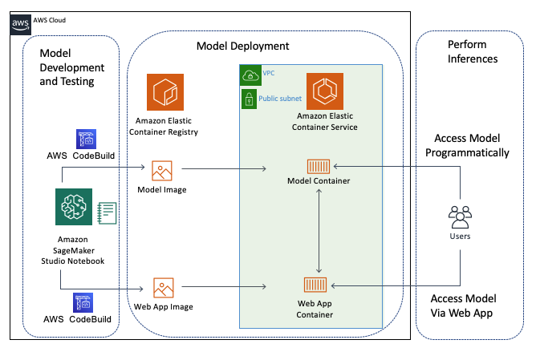

As you can see, there are three sections. 

1. In the first section `Model Development and Testing` we will use the SageMaker Studio Integrated Development Environment (IDE) for building the application. [SageMaker Studio](https://aws.amazon.com/blogs/aws/amazon-sagemaker-studio-the-first-fully-integrated-development-environment-for-machine-learning/) is an IDE developed specifically for machine learning. 
2. In the second section `Model Deployment` we will deploy both the model and a web app (powered by [Streamlit](https://www.streamlit.io/) for querying the model. Both the model and the web app will be packaged as [Docker](https://www.docker.com/) containers using [AWS CodeBuild .](https://aws.amazon.com/codebuild/)They will be first registered with [Amazon Elastic Container Registry](https://aws.amazon.com/ecr/) (ECR) and then deployed on [Amazon Elastic Container Service](https://aws.amazon.com/ecs/)(ECS) using [AWS Fargate](https://aws.amazon.com/fargate/). For a more in-depth tutorial on deploying Streamlit apps to ECS; checkout out [this](https://towardsdatascience.com/deploy-pycaret-and-streamlit-app-using-aws-fargate-serverless-infrastructure-8b7d7c0584c2) blog post.
3. In the third section `Perform Inferences` we will perform some inferences using our model and web app.

## Contents

The content of the workshop is as follows:

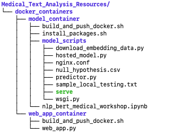

## Workshop Requirements

You will need an AWS account to use this solution. Sign up for an account [here](https://aws.amazon.com/).

You will also need to have permission to use [AWS CloudFormation](https://aws.amazon.com/cloudformation/) and to create all the resources detailed in the [architecture section](https://github.com/awslabs/sagemaker-dashboards-for-ml#architecture). All AWS permissions can be managed through [AWS IAM](https://aws.amazon.com/iam/). Admin users will have the required permissions, but please contact your account's AWS administrator if your user account doesn't have the required permissions.

## Steps for deploying CloudFormation Template

To run this workshop, you will need to first deploy the CloudFormation Template.

* Download the CloudFormation Template from this repository. The file is called `cloudformation_template.yaml`

* Open the AWS Console
* Select "CloudFormation" from the list of services
* Select “Stacks” from the sidebar
    * 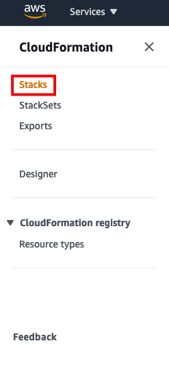
* Select "Create stack" and choose "With new resources (standard)"
    * 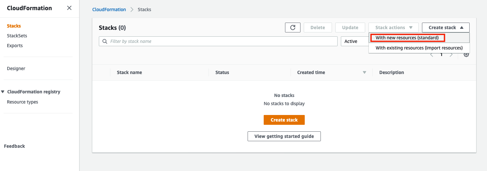
* Step 1: Specify template
    * Under the Prepare template section select "Template is ready"
    * Then under the Specify template section select "Upload a template file"
    * Click the "Choose file" button and upload your cloudformation template
    * Then select "Next"
    * 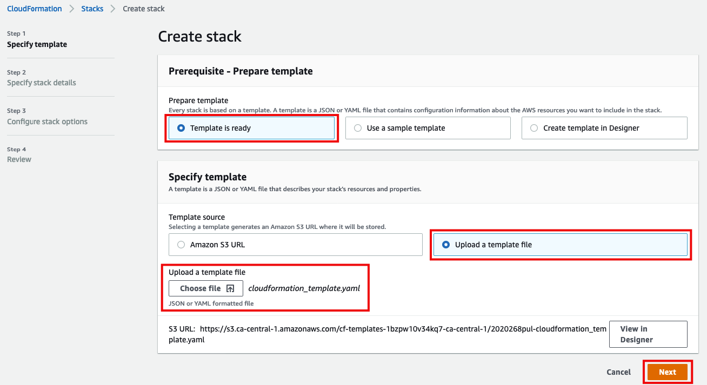
* Step 2: Specify Stack Details
    * Enter Medical-Text-Analysis as the "Stack name" and as the "EnvironmentName"
    * Click "Next"
    * 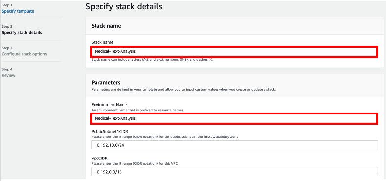
* Step 3: Configure Stack Options
    * Optional: Add any tags that you want to be applied to the resources in your stack
    * Leave everything else as default and select "Next"
* Step 4: Review 
    * Review over all of the information and at the bottom of the page select the checkbox to acknowledge that this cloudformation template will be creating an IAM resource.
    * Then select "Create Stack"
    * 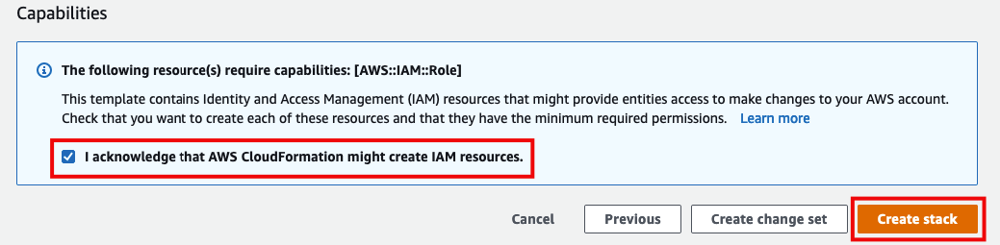

## Steps for opening SageMaker Studio

* Once the cloudformation template has finished deploying all of the resources, open SageMaker from the main [AWS console](https://console.aws.amazon.com/) 
* We will be using SageMaker Studio for this workshop. Here’s the [list of regions](https://docs.aws.amazon.com/sagemaker/latest/dg/regions-quotas.html) that SageMaker Studio is available in. Note that to later delete a SageMaker Studio domain, You must have admin permissions.
* Go to SageMaker Studio by selecting the tab on the side bar
    * 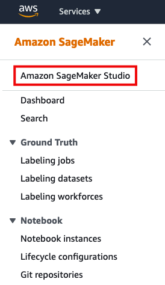
* If this is your first time using the SageMaker Studio console, you will need to first set it up. 
    * Choose the "Quick start" option
    * Set the “User name” to “Medical-Text-Analysis-User” (or any other user name will do!)
    * For the Execution role, select the IAM role that was created when the CloudFormation template was deployed. This will look something like “Medical-Text-Analysis-Sentence-RelevanceRole-XXXXXXXXXXXXX”
    * Select Submit
    * 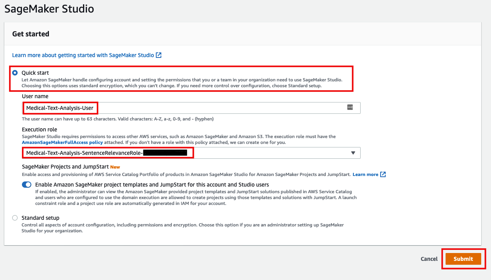
* If this is not your first time using SageMaker Studio, go ahead and just create a new user 
    * Select “Add User”
    * 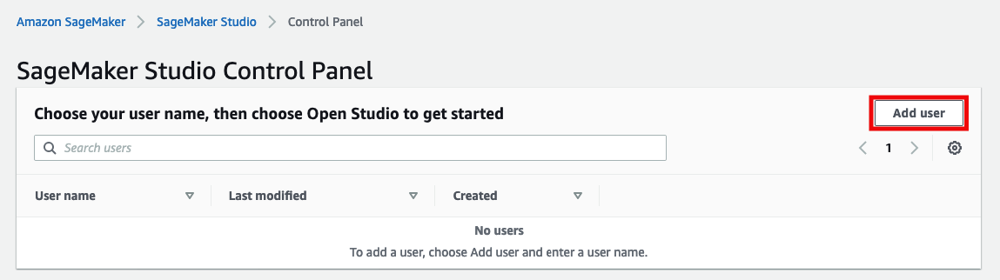
    * Select “Quick Start”
    * Set the “User name” to “Medical-Text-Analysis-User” (or any other user name will do!)
    * For the Execution role, select the IAM role that was created when the CloudFormation template was deployed. This will look something like “Medical-Text-Analysis-Sentence-RelevanceRole-XXXXXXXXXXXXX”
    * Select Submit
    * 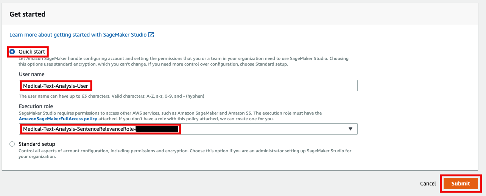
* You will then be prompted to choose a VPC and Subnet you would like to use for SageMaker Studio. Select `sentence_relevance_VPC`. There is only one subnet in that VPC; select it.
* Once you choose your VPC and Subnet, you will then be brought to the Amazon SageMaker Studio Control Panel where you will see a bar at the top explaining that it is “Preparing Amazon SageMaker Studio”. This will take a few minutes to create.
* Once SageMaker studio is ready (this will take about 5 minutes), find your Username and select “Open Studio”
    * 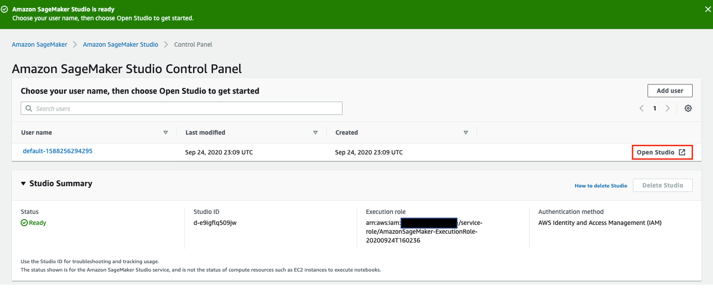
* Once the studio opens, clone this repo into the SageMaker Studio console from the terminal by entering:

 `git clone https://github.com/aws-samples/medical-text-sentence-relevance-bert.git` 

(note: you can also download this repository manually and upload it to SageMaker Studio).

* Click on the directory `Medical_Text_Analysis_Resources`, then  `docker_containers`  and finally the folder `model_container”`and double click on “nlp_bert_medical_workshop.ipynb” to open the notebook
    * 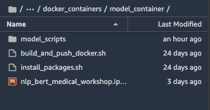
* Choose Python 3 (Data Science) as your preferred kernel 
    * NOTE: This might take a few minutes to start up
    * 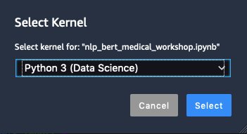

* In the top right of the notebook click on “Unknown” and set to ml.m5.large
    * * 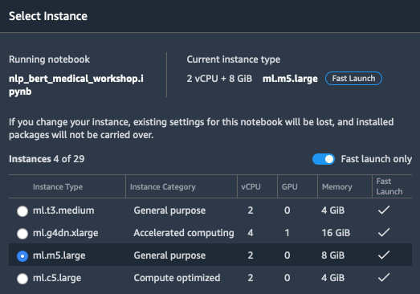

The rest of the instructions for deploying the solution in a step-by-step manner are in the notebook `nlp_bert_medical_workshop.ipynb.` Open up that notebook and get to work!

## Cleaning Up

# Cleanup

When you've finished with this solution, make sure that you delete all unneeded AWS resources. This solution used a combination of automated deployed resources (using CloudFormation) along with manually deployed resources that you created. Note that if you try to delete the stack prior deleting the manually created resources, those specific resources (and dependent resources) will **not** be deleted.

1. From the ECS Clusters, manually de-deploy the deployed containers by clicking the running tasks and selecting `Stop`.

2. From the ECS Task Definition section; de-register the task definitions you created by clicking on the name of the task, checking the checkbox, and in the `Actions` button, click `Deregister`

3. From the AWS ECR Console,manually delete the registered images by selecting each one and clicking `Delete`

4. From the AWS SageMaker Console,  [delete the SageMaker Studio user and domain you created](https://docs.aws.amazon.com/sagemaker/latest/dg/gs-studio-delete-domain.html). You will need to delete all associated Apps, the User, and finally the Domain.
 
**Note**: if you receive an error  `ResourceInUse The ID or Name specified is already in use` when deleting the User or Domain, you can still continue to the next step to delete the resources and the CloudFormation template. 
         

5. Navigate to the EFS console (https://console.aws.amazon.com/efs) and delete the file system that is created by SageMaker Studio.  You can see which EFS file system to delete by clicking on the File system id (e.g fs-38643jda) and clicking Tag; the file system will show which SageMaker Studio domain is associated with it. 

6. Navigate to the VPC console (https://console.aws.amazon.com/vpc) and manually delete the VPC we used for SageMaker Studio, the VPC will have a Name of `sentence_relevance_VPC`.Click on the VPC ID , Actions and Delete VPC Then delete the VPC. Note that we are manually deleting the VPC to avoid any possible roleback errors when deleting the stack.

5. Finally, go to the AWS CloudFormation Console, and delete the `Medical_Text_Analysis` stack. 

## Useful Resources

* [CloudFormation User Guide](https://docs.aws.amazon.com/AWSCloudFormation/latest/UserGuide/Welcome.html)
* [Amazon SageMaker Developer Guide](https://docs.aws.amazon.com/sagemaker/latest/dg/whatis.html)
* [Amazon SageMaker Studio Guide](https://docs.aws.amazon.com/sagemaker/latest/dg/studio.html)

## Credits

* [Bio_ClinicalBERT](https://huggingface.co/emilyalsentzer/Bio_ClinicalBERT)
* [MTSamples](https://www.mtsamples.com/)

## Security

See [CONTRIBUTING](CONTRIBUTING.md#security-issue-notifications) for more information.

## License

This library is licensed under the MIT-0 License. See the LICENSE file.

